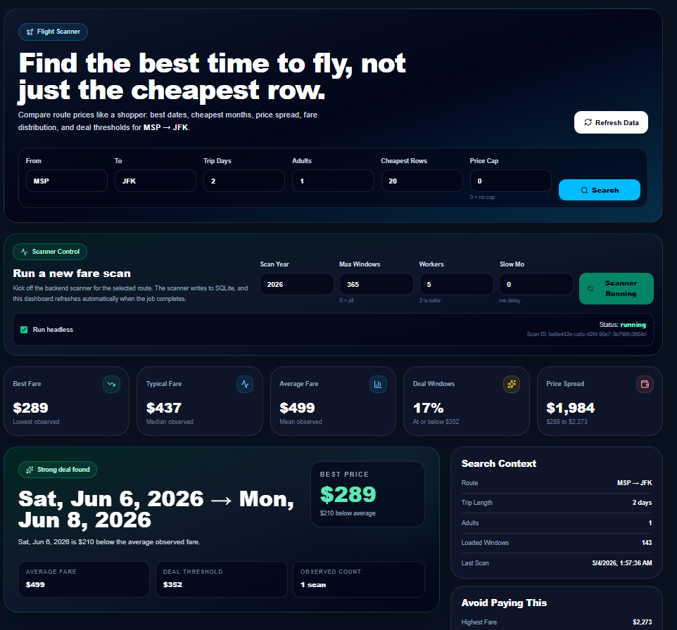
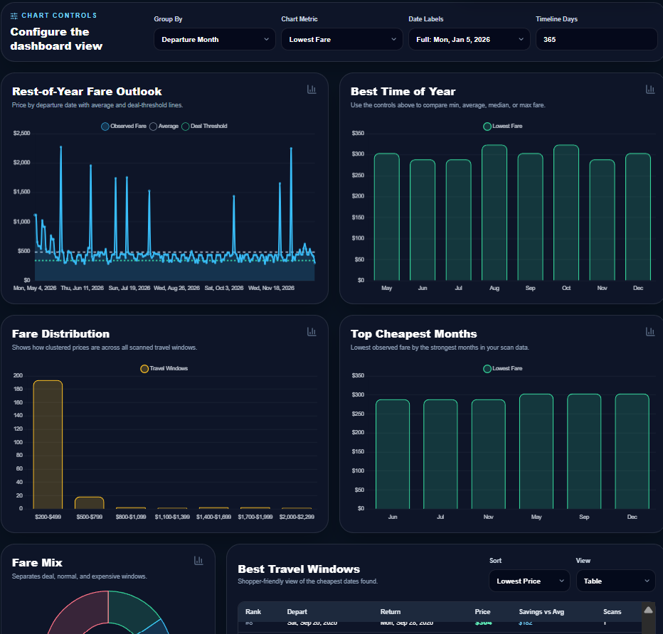

# FlightOrFlight

FlightOrFlight is a personal travel-window analytics dashboard for flexible travelers.

Instead of asking, “What is the price for these exact dates?”, FlightOrFlight asks:

> “I want to go from one city to another for a fixed trip length. What are the cheapest dates to go this year?”

The project scans possible departure and return windows, stores observed fares, and turns them into a shopper-friendly dashboard with ranked travel windows, fare trends, price distributions, deal thresholds, and route-level analytics.

---





## Why this exists

Most flight tools are optimized for booking a specific trip. They are good at answering:

- “What does MSP → HNL cost on June 10?”
- “What happens if I shift my trip by a few days?”
- “Can I track this specific route?”

FlightOrFlight is designed for a more flexible traveler:

- “I want a 3- or 4-day trip sometime this year.”
- “Tell me the cheapest windows.”
- “Show me what a normal price looks like.”
- “Tell me whether this fare is actually a good deal.”
- “Give me a link back to the observed deal.”

The goal is to act less like a normal flight search box and more like a travel-window optimizer.

---

## Features

### Flexible trip scanning

Scan a route across many departure windows:

- origin airport
- destination airport
- trip length
- number of adults
- scan year
- max windows
- worker count
- headless browser mode

Example:

```txt
MSP → HNL
4-day trip
1 adult
All windows in 2026
```

---

### Fare observation storage

Each scan saves a normalized observation:

- scan ID
- scan timestamp
- origin
- destination
- departure date
- return date
- trip length
- adults
- cheapest observed price
- status
- raw context snippet
- provider
- optional deal URL

This makes the app useful beyond one-time scraping. You can build history, compare multiple scans, and determine whether a price is cheap relative to prior observations.

---

### Analytics dashboard

The dashboard includes:

- best observed fare
- median fare
- average fare
- price spread
- deal-window percentage
- rest-of-year fare outlook
- best month or weekday analysis
- fare distribution
- cheapest month ranking
- fare mix breakdown
- ranked best travel windows
- card and table views
- configurable chart controls

---

### Scanner control from the UI

The frontend can start a backend scan job without blocking the dashboard.

The UI calls backend endpoints such as:

```txt
POST /scan/start
GET  /scan/status/{scan_id}
GET  /prices
GET  /prices/cheapest
GET  /summary
```

This lets the dashboard remain usable while the scanner runs in the background.

---

## Tech stack

### Frontend

- Next.js
- React
- TypeScript
- Tailwind CSS
- Chart.js
- react-chartjs-2
- lucide-react

### Backend / Data

- Python
- FastAPI
- SQLite for local development
- Playwright for browser automation
- pandas for CSV backup/export

---

## Project architecture

```txt
FlightOrFlight
├── frontend
│   ├── dashboard UI
│   ├── chart analytics
│   ├── scanner controls
│   └── API calls
│
├── backend
│   ├── FastAPI endpoints
│   ├── scan job management
│   ├── price queries
│   └── route summaries
│
├── scanner
│   ├── Playwright browser automation
│   ├── date-window generation
│   ├── route search
│   ├── price extraction
│   └── result persistence
│
└── database
    ├── SQLite observations table
    ├── route indexes
    ├── date indexes
    └── price indexes
```

---

## Data model

The core table stores fare observations rather than replacing previous prices.

```sql
CREATE TABLE IF NOT EXISTS flight_price_observations (
    id INTEGER PRIMARY KEY AUTOINCREMENT,

    scan_id TEXT NOT NULL,
    scanned_at TEXT NOT NULL,

    origin TEXT NOT NULL,
    destination TEXT NOT NULL,

    depart_date TEXT NOT NULL,
    return_date TEXT NOT NULL,

    trip_length_days INTEGER NOT NULL,
    adults INTEGER NOT NULL,

    cheapest_price_usd INTEGER,
    status TEXT NOT NULL,
    raw_context TEXT,

    deal_url TEXT,
    provider TEXT DEFAULT 'Google Flights',

    created_at TEXT DEFAULT CURRENT_TIMESTAMP
);
```

This design allows the app to track how prices change over time and compare the latest result against historical observations.

---

## Deal scoring

FlightOrFlight uses observed prices to determine whether a fare looks attractive.

A simple deal threshold can be calculated using:

```txt
deal_threshold = min(25th_percentile_price, average_price - 0.5 * standard_deviation)
```

A fare is considered a deal when:

```txt
price <= deal_threshold
```

This is intentionally heuristic. It is not a guarantee that a fare is the best possible market price. It is a practical way to highlight windows that are cheap relative to the route’s observed data.

---

## Getting started

### Quickstart

From a fresh clone on macOS or Linux:

```bash
git clone https://github.com/JonathanParaschou/FlightOrFlight.git
cd FlightOrFlight
bash scripts/setup.sh
bash scripts/dev.sh
```

Then open:

```txt
http://localhost:4000
```

The API runs at:

```txt
http://127.0.0.1:8000
```

The setup script creates `.venv`, installs Python packages, installs the Chromium browser Playwright needs, and installs frontend packages.

---

### Manual setup

Use this path if you prefer to run each piece yourself.

#### 1. Clone the repository

```bash
git clone https://github.com/JonathanParaschou/FlightOrFlight.git
cd FlightOrFlight
```

#### 2. Install Python dependencies

Create and activate a virtual environment:

```bash
python -m venv .venv
```

On Windows PowerShell:

```powershell
.venv\Scripts\Activate.ps1
```

On macOS/Linux:

```bash
source .venv/bin/activate
```

Install dependencies:

```bash
pip install -r requirements.txt
```

Install Playwright browsers:

```bash
playwright install
```

---

#### 3. Start the backend

The frontend expects the API to run on:

```txt
http://127.0.0.1:8000
```

Start the FastAPI server:

```bash
uvicorn api:app --reload --port 8000
```

---

#### 4. Start the frontend

Install frontend dependencies:

```bash
cd web
npm install
```

Run the development server:

```bash
npm run dev
```

Then open:

```txt
http://localhost:4000
```

---

## Local development commands

```bash
# Install everything needed for local development
bash scripts/setup.sh

# Run FastAPI and Next.js together
bash scripts/dev.sh

# Run only the API
source .venv/bin/activate
uvicorn api:app --reload --port 8000

# Run only the web app
cd web
npm run dev
```

The dashboard expects the backend at `http://127.0.0.1:8000`. The backend allows browser requests from `http://localhost:4000` and `http://127.0.0.1:4000`.

## Running a scan

You can start a scan from the dashboard or run the scanner directly, depending on your local setup.

Recommended local scanner settings:

```python
max_workers = 1 or 2
headless = True
slow_mo = 0
```

Avoid high worker counts for browser automation. Ten parallel browser workers can create unreliable page loads, database write contention, and traffic patterns that look less like normal personal use.

---

## Recommended usage

This project is best used as:

- a personal travel analytics tool
- a portfolio project
- a flexible-date travel research dashboard
- an experimentation platform for route/date optimization
- an analytics layer over user-provided or permitted fare data

---
